## **Architectural Concept: A Unified, Memory-Aware Streaming Classification Engine (Revision 8)**

### **Guiding Principles**

#### 1. **Architectural Elegance Feedback**

Optimization pressure that violates these core principles shall be interpreted an useful signal that indicates incomplete architectural modeling, thus is no-justification for exceptions. The system must evolve its formal abstractions to subsume valid optimizations as first-class primitives, never compromise its contracts.

> **When emergent efficiency gains contradict current constraints:**
>
> 1. **Suspend implementation** of the optimization
> 2. **Formalize the pattern** as a documented architectural primitive
> 3. **Reify the optimization** through revised contracts & DAG extensions
>
> _Example:_ Discovering a kernel fusion opportunity that violates interface verifiability triggers:
>
> - Halting ad-hoc fusion attempts
> - Modeling fused operation in Design Document as new DAG node type
> - Defining strict fusion contracts in Kernel Headers
> - Implementing through host-controlled parameter switches, not hidden logic

#### 2. **Primacy of Memory Strategy**

The singular goal of the host-side orchestration is to ensure the core computation executes in the fastest possible memory tier (Registers > Local > Global). This principle drives all design decisions, prioritizing memory efficiency over computational complexity.

> **Data organization is inherently informed by the target hardware’s memory hierarchy and access patterns.** The system prioritizes layouts that harmonize with fundamental theoretical constraints of the hardware class (e.g., alignment principles, memory bank theory, access granularity axioms) to optimize computational pathways for throughput and scalable efficiency. This principle elevates hardware-class-aware design as a first-class concern, ensuring implementations achieve maximal bandwidth utilization and latency hiding through generalized hardware paradigms, not ad-hoc device-specific optimizations.

#### 3. **Modular, "Dumb" Kernels**

Kernels are simple, single-purpose modules. The architecture avoids complex branching ("smart" kernels) and monolithic designs in favor of composability. Where a complex data transformation is a critical-path bottleneck unsolved by generic tools, a **specialized, single-purpose kernel** will be employed. This specialist kernel remains "dumb"—stateless and reliant on the host for all contextual parameters.

> **Branching is orthogonal to modularity.** When a kernel's core operation diverges fundamentally between use cases (e.g., CCE vs. BCE loss gradients), this document permits two valid strategies:
>
> - **(A) Single Kernel with Host-Injected Flag:** A unified kernel uses a `FLAG__` scalar to toggle paths, provided the divergence is manageable.
> - **(B) Separate Kernels:** Distinct kernels are expected when divergence is complex or imposes conflicting memory patterns.

#### 4. **Backend-Neutral Plan Model**

Simple kernels are composed into a logical Directed Acyclic Graph (DAG) expressed as an immutable, backend-neutral execution plan—a data structure, not executable code. Each target backend (OpenCL, Vulkan, CPU) receives this plan and renders it using its native execution model. The architecture trusts each backend's rendering tier to handle low-level optimizations within its jurisdiction. The number of nodes in the plan is a non-goal, emphasizing adaptability over rigid structure.

#### 5. **Unified Execution Model**

All workflows follow Act (forward pass) then Learn (backpropagation) sequencing, manifesting as either **Sequential Execution Mode**—where Act-Learn phases execute contiguously for pre-labeled batches—or **Event-Triggered Execution Mode**—where Learn-phase execution awaits an external readiness signal post-Act. This split-phase approach ensures consistency across all use cases.

#### 6. **Architectural Hierarchy**

The system observes a strict tripartite authority structure to prevent circular dependencies and ensure traceable design decisions:

- **1. Conceptual (This Document):** Sovereign authority defining **what** must be achieved and **why**. Contains all principles, component definitions, and validation scenarios. Structural decisions that realize these mandates are recorded in the ADR chain (ADR-001 through ADR-018); once accepted, an ADR's decision is binding on all downstream layers.

  - _Example Mandate:_ "Optimizer implementations must avoid precision erosion across unbounded training steps"
  - _Example ADR:_ ADR-002 establishes the five-node plan type taxonomy as the closed vocabulary for the execution plan

- **2. Contractual (Kernel Headers & Contracts):** Binding authority formalizing **interface requirements**. Translates conceptual mandates into human/machine-verifiable API contracts, expressed as `KernelContract` frozen dataclasses and the `CONTRACT.md` articles.

  - _Example Enforcement:_ `adam_update` kernel's `KernelContract` requires `src_scalar_REAL_beta1_pow_t` parameter

- **3. Design (Implementations):** Subordinate authority implementing **how** to fulfill superior layers. Never influences higher layers.
  - _Example Execution:_ Host computes `beta1**t` using FP64 regardless of `SCALAR_TYPE`

#### 7. **No Silent Monoliths**

All executions manifest externally as an Act/Learn split, even if phases are contiguous, ensuring consistency and enabling inter-phase optimization. This eliminates silent assumptions of single-pass execution, reinforcing the architecture’s phased nature.

---

### **Core Architectural Components**

#### **1. Modular, Chunk-Based Compute Kernels**

The architecture is built upon a foundation of modular, reusable kernels that operate on "chunks" of a larger problem. Work is segmented across multiple dimensions—such as the number of modules, batch size, and number of classes—as dictated by resource constraints. Each `Classifier Module`, representing the system implementation of a machine learning 'Head,' is configured with an **Operating Mode** (`CCE` for single-label or `BCE` for multi-label tasks).

#### **2. The Recursive, Tiered Aggregation Engine**

At the core of the architecture lies a powerful aggregation engine that implements a **recursive, multi-stage reduction tree**. Governed by a host-configurable parameter, `K`—the **Reduction Batch Size**—this engine defines the width of the parallel kernel front at each reduction stage. This `log_K(N)` strategy breaks the `O(N)` memory dependency of a flat aggregation model, enabling scalability to problems of arbitrary size. The engine employs three tiers of `aggregate_*` kernels (Identity, Register, Local) selected by the Host Orchestrator based on the number of clipped partials being reduced at any given stage.

It is critical to note that this 'Engine' is not a monolithic kernel. It is an emergent property of the Host Orchestrator intelligently composing numerous simple `aggregate_*` kernels in a `log_K(N)` tree structure. This composition is made safe and verifiable by two core contracts:

1. The **`Placement Contract`** governs how parallel kernels _write_ their scattered partial results.
2. The **`Indirection Contract`** governs how `aggregate_*` kernels _read_ these scattered partials.

This indirection-based model is a cornerstone of the **Primacy of Memory Strategy**. By providing the aggregation kernels with a list of memory offsets (`offset_list`), the Host Orchestrator eliminates the need for intermediate device-to-device memory copies at every stage of the reduction, maximizing bandwidth for computation.

#### **3. Gradient Stabilization**

##### **3.1. The Methods of Gradient Clipping**

This architecture acknowledges degrees for Gradient Clipping, defined as Vector-Wise Scaling. The methods differ only in the **scope of their L2 norm calculation**. They are neutral tools; their purpose is determined by the context in which they are applied.

1.  **`Full-Group-Wise Clipping`**

    - **Mechanism:** This method operates on the principle of **"gather and regulate."** It treats the full group of gradients as a single, atomic vector. It computes one L2 norm over the entire pre-summed group and applies a single scaling factor, perfectly preserving the relative magnitudes of all vectors _within_ the group.
    - **Key Property:** Requires a full, synchronizing reduction of the group before it can be applied, making it architecturally expensive.

2.  **`Partial-Group-Wise Clipping`**

    - **Mechanism:** This method operates on the principle of **"assemble and scale."** It treats a practical sub-group of gradients as a single, partial vector. It computes one L2 norm over the pre-summed group and applies a single localized scaling factor, preserving the local-relative magnitudes of all vectors _within_ a sub-group.
    - **Key Property:** Requires a local barrier, synchronizing reduction of the sub-group before it can be applied, relatively cheap.

3.  **`Component-Wise Clipping`**
    - **Mechanism:** This method operates on the principle of **"divide and conquer."** It treats a logical group of gradients as a collection of independent components (tiles/chunks). It computes a local L2 norm for each component and applies a scaling factor to that component alone, preserving only the component's internal gradient direction.
    - **Key Property:** Massively parallel and efficient, requiring no cross-component synchronization, but alters the relative magnitudes _between_ components.

##### **3.2. The Goals of Clipping**

There are two distinct goals that a clipping method can be used to achieve:

1.  **Algorithmic Regulation:** The user-level goal of guiding the learning process by constraining gradient norms. This is governed by a user-defined hyperparameter, `T_algorithmic`.
2.  **Numerical Safety:** The system-level goal of preventing `NaN`/`Inf` overflow by enforcing the physical limits of the hardware's number format. This is governed by a high, mechanically-derived safety threshold, `T_safety`.

##### **3.3. The System's Policy-Driven Stabilization Strategy**

The architecture abandons a simplistic single-pass clipping model in favor of a sophisticated, **multi-stage clipping strategy** that operates in synergy with the `log_K(N)` Recursive Reduction Engine. Instead of applying a single, compromised threshold, the system employs a policy-driven approach to set an independent, optimal clipping threshold at each layer of the reduction tree.

The default strategy is the **Quadratic Scaling Policy**, which provides fine-grained control over the threshold schedule by scaling it based on the layer's distance from the final reduction.

The threshold `T_j` for a given layer `j` (where `j` is the number of aggregation steps away from the final root) is calculated as:

**`T_j = T_{algorithmic} + λ ⋅ j²`**

- **`T_algorithmic`**: The user's target `global_max_grad`. This serves as the **anchor point** of the policy, defining the final threshold to be met at the root of the reduction tree (`j=0`).
- **`j`**: The layer index relative to the root (`j=0` is the root, `j>0` are preceding layers).
- **`λ` (lambda)**: A user-defined, non-negative **Scale Parameter** that dictates the curvature of the policy funnel.
  - A **larger `λ`** creates a more permissive, wider funnel, prioritizing the preservation of gradient information from initial samples.
  - A **smaller `λ`** creates a more restrictive, narrower funnel, enforcing tighter constraints throughout the reduction.
  - When **`λ = 0`**, the policy gracefully degrades to a "Fixed Ceiling" strategy, applying `T_algorithmic` at all layers.

This policy-driven approach is computationally efficient, using the fast `Component-Wise` clipping method at each stage. It transforms stabilization from a single, coarse action into a nuanced, scheduled process.

##### **3.4. Orthogonal Enforcement of Numerical Safety**

The Quadratic Scaling Policy enables the formal architectural separation of **Algorithmic Regulation** from **Numerical Safety**. The two goals are no longer conflated by a `min()` function; they operate as orthogonal concerns.

1.  **The Algorithmic Policy (`T_algorithmic`, `λ`)** is calculated first. It defines the ideal, user-intended threshold curve for guiding the learning process. Its role is to define the "path."
2.  **The Safety Threshold (`T_safety`)** acts as a final, non-negotiable "boundary." It represents the physical hardware limit and is applied as a clamp to the policy's output.

This boundary, `T_safety`, is not a static value. It is a **dynamic budget** determined by the geometry of the reduction at each stage. To prevent summation-induced overflow, the safety threshold `T_safety_j` for a given stage `j` with a reduction fan-in of `K_j` is calculated as:

**`T_safety_j = FP_FORMAT_MAX / K_j`**

- **`FP_FORMAT_MAX`**: A conservative, high value representing the maximum representable number for the current precision (e.g., `~6.5e4` for FP16, `~3.4e38` for FP32).
- **`K_j`**: The number of partial results being summed by the `aggregate_*` kernel at stage `j`.

The Host Orchestrator implements this separation with a clean, two-step logic for each layer `j`:

1.  **Calculate Policy Threshold:** `policy_threshold = T_algorithmic + λ * j²`
2.  **Enforce Safety Boundary:** `final_threshold_for_layer_j = min(T_safety, policy_threshold)`

This elegant separation ensures the user's algorithmic intent is maximally respected within the fundamental, non-negotiable constraints of the hardware, resolving the logical tension of the previous single-threshold model.

##### **3.5. Architectural Extensibility for Alternative Policies**

The system's default and recommended stabilization strategy employs a sophisticated, two-level approach that is formally described as follows:

1.  **Inter-Tile Strategy: `Component-Wise`**. The batch is decomposed into independent tiles (components). Each tile is processed in parallel and clipped independently of all others.
2.  **Intra-Tile Strategy: `Partial-Group-Wise (Tile Scope)`**. The crucial initial clipping operation (Node 11) within each tile is performed using a `Partial-Group-Wise` method. It computes a single L2 norm across the entire group of partial gradients (`Grad_ModW`, `Grad_ModB`, etc.) for that tile, preserving the complete gradient direction _within that component_.

This nested `Component-Wise` / `Partial-Group-Wise` combination is then followed by the **Quadratic Scaling Policy**, which is applied using `Component-Wise` clipping at each stage of the subsequent reduction tree.

Implementations may choose to make an natural extension to support a **`Per-Item Threshold Override`** for the computed gradients going into the `Partial-Group-Wise Clipping` leaf-pre-reduction-stage. This would offer fine-grained control for advanced strategies like non-uniform regularization, operating orthogonally to the policy applied during the subsequent reduction phase.

A Host Orchestrator could be configured to implement a true **`Group-Wise`** clipping policy for workloads that demand perfectly preserved relative gradient magnitudes. This would require extending the kernel set to include the necessary pre-summation and global norm calculations, and it would come at a significant host complexity, performance and synchronization cost. Such an extension is considered a specialized, scientific execution path.

#### **4. Asynchronous Host Interaction**

The processing of each batch spans two event-delimited phases whose temporal relationship is controlled by the user:

- **Act Phase**: Concludes when complete, aggregated forward-pass results (`Final Probs`) become available on the host, signaled by the `inference_event`. Results are delivered through a `RetrievalFuture`—a Protocol with `.wait()`, `.result()`, and `.release()` methods that adapts to each backend's native observation mechanism (zero-copy pointer access for CPU, async D2H transfer completion for GPU backends).
- **Learn Phase**: Triggered by the host when ground truth is ready, concluding when all device-side computations for the training batch complete, signaled by the `final_batch_event`. Device-side intermediate buffers are not retained between phases; the Learn plan recomputes any required activations, trading negligible redundant computation for immediate VRAM release and elimination of stale-activation risk.

The user-facing expression of this temporal split is the **WorkTicket**—a stateful object whose lifecycle mirrors the Act/Learn separation:

| Ticket State | Transition | Synchronization Point |
| :--- | :--- | :--- |
| `PENDING` | `engine.submit(x_data)` | — |
| `ACT_COMPLETE` | `ticket.get_prediction()` | `inference_event` |
| `RESOLVED` | `ticket.resolve(y_data)` | — |
| `CONSUMED` | `learn_handle.wait()` | `final_batch_event` |

This model natively expresses both **Sequential Execution Mode** (resolve immediately after submit) and **Event-Triggered Execution Mode** (inspect prediction, defer resolution until ground truth arrives) through identical syntax, with no mode flag or conditional branching.

#### **5. The Three-Tier Jurisdictional Model**

The system's computational jurisdiction is partitioned into three tiers that correspond to naturally separable concerns:

- **Policy Tier (Shared Layer):** Produces the backend-neutral execution plan. All non-trivial shared computation—plan construction, contract validation, reduction tree planning, buffer lifecycle annotation, threshold scheduling, tiling, activation lifecycle decisions—occurs here. The Policy tier is the sole tier invariant across all backends and all node types.

- **Orchestration Tier (Per-Backend Rendering):** Receives the execution plan and renders it using the backend's native dispatch model. OpenCL enqueues per-tile `clEnqueueNDRange` calls with event chains. Vulkan records a command buffer with `vkCmdDispatch` and `vkCmdPipelineBarrier`. CPU calls `pool_dispatch_and_wait` per node. Kernel tier selection for reduction trees (register-reduce vs. local-reduce), buffer allocation via native allocators, and synchronization primitive management are Orchestration-tier concerns.

- **Execution Tier (Kernel Internals):** The algorithm inside a compiled kernel. Governed by the kernel contract's Behavioral Invariants specification, never prescribed by the plan or the rendering layer. Node 16's internal multi-stage reduction exemplifies the Orchestration/Execution tier collapse: when the upstream Item Synchronization Point (Node 13) guarantees contiguous input, the host-driven inter-stage logistics that necessitate Orchestration-tier participation for Nodes 14/15/20 are eliminated, and the kernel manages its own reduction internally.

This model provides a formal criterion for where new functionality belongs: if a computation must produce identical results across backends, it is a Policy concern and belongs in the shared plan. If it adapts to backend-specific capabilities, it is an Orchestration concern. If it is internal to a kernel's algorithm, it is an Execution concern.

#### **6. The Backend-Neutral Execution Plan**

The execution plan is a directed acyclic graph of typed, immutable node descriptors connected by explicit dependency edges. It replaces the implicit `cl.Event` chains of the monolithic implementation with a first-class, inspectable data structure.

The plan's node vocabulary is a **closed taxonomy** of five types:

| Node Type | Semantics |
| :--- | :--- |
| `KernelDispatchNode` | A single logical kernel invocation with buffer bindings, scalar parameters, tile decomposition, and placement strategy. |
| `ReductionTreeNode` | A multi-stage `log_K(N)` reduction tree, carrying fan-in, pre-computed threshold schedule, and initial offset lists. Rendered atomically by the backend, which selects kernel tiers and manages intermediate buffers. |
| `StreamingLoopNode` | A parametric loop over a chunk-indexed body of `KernelDispatchNode`s. Specifies chunk count and per-chunk parameter strides; the backend instantiates per-chunk parameter values from base + index × stride. |
| `BarrierNode` | A named synchronization point that joins upstream dependency edges. Carries no dispatch payload—it is a pure sequencing construct. |
| `RetrievalNode` | A host-accessible result extraction point, specifying the source buffer, expected shape, and the named event it signals. |

No additional node types may be introduced without a formal architectural decision. Per Principle §1 (Architectural Elegance Feedback): when an optimization requires a construct beyond this vocabulary, implementation is suspended and the pattern is formalized as a new first-class node type.

The plan's dependency edges are the concurrency specification. Nodes with no dependency relationship may execute in parallel; the backend is free to exploit this. No explicit concurrency annotations are required. A `KernelDispatchNode` with `tile_count=N` specifies logical parallelism—not dispatch granularity. Whether N tiles become N `clEnqueueNDRange` calls, one `vkCmdDispatch(N,1,1)`, or N thread-pool tasks is a backend rendering concern.

#### **7. The Kernel Contract Model**

Each kernel's interface is formalized as two complementary artifacts:

- **`KernelContract` (Shared Layer):** A frozen, backend-neutral dataclass carrying the kernel's complete interface specification—parameter names, types, shapes, padding contracts, placement strategies, and validation preconditions. The Policy tier uses this for pre-dispatch validation at plan-construction time. A plan is only valid if every `KernelDispatchNode`'s buffer bindings and scalar parameters satisfy its associated `KernelContract`.

- **`KernelBinding` (Per-Backend):** A backend-specific dispatch adapter that translates abstract placement keys and buffer references into native dispatch arguments. Tile index delivery—host-provided `flat_tile_index` scalar (OpenCL), `gl_WorkGroupID.x` (Vulkan), or `task_index` parameter (CPU)—is a binding concern, not a contract concern.

This split ensures that interface validation is shared (no duplication across backends) while dispatch mechanics remain backend-native (no lowest-common-denominator abstraction).

#### **8. The Buffer Lifecycle**

Every device-side buffer in the execution plan is described by a `BufferDescriptor` carrying:

- **`producing_node`**: The unique node that writes the buffer.
- **`consumers`**: The set of nodes that read the buffer.
- **`last_consumer`**: The final reader, after which the buffer may be freed.
- **`role`**: One of four lifecycle roles—`MODEL_STATE` (persists across batches), `BATCH_INPUT` (uploaded per batch), `BATCH_INTERMEDIATE` (temporary computation product), or `BATCH_OUTPUT` (returned to the host).

Buffer lifetimes are plan-prescribed: the Policy tier annotates each buffer's lifetime interval, and the Orchestration tier manages allocation and deallocation according to these annotations. Each plan's buffer namespace is fully self-contained—no buffer persists across plan boundaries, enabling immediate VRAM release after each plan completes.

#### **9. Multi-Backend Architecture**

The system supports three compute backends:

- **OpenCL (PyOpenCL):** Runtime-compiled kernels from the architecture's `kernels/` directory. Per-tile imperative dispatch with `cl.Event` synchronization. The original and reference backend.
- **Vulkan (vulkan-python):** GLSL compute shaders compiled to SPIR-V at build time. Single-dispatch parallelism (`vkCmdDispatch(N,1,1)`) with pipeline barriers recorded into command buffers.
- **CPU (ctypes):** Native C implementations compiled to a shared library. Deterministic, single-threaded-per-task execution via `pool_dispatch_and_wait`. Struct layout verification at library load time prevents silent FFI corruption.

All backends implement from the same algorithmic specification (`kernels.cl.h`), which serves as the language-neutral reference for every kernel's mathematical operation. Per-backend source files reside in `src/backends/<name>/kernel_sources/`, with the shared orchestration layer in `src/shared/`. This physical isolation ensures that changes to one backend cannot affect another.

The build system (Meson with `meson-python`) conditionally enables each backend via `feature` options (`backend_opencl`, `backend_vulkan`, `backend_cpu`) with `auto` as the default—each backend is available when its toolchain is detected, absent otherwise, requiring no manual configuration. A generated `_build_config.py` module declares each backend's availability as a boolean, serving as the single authoritative source for runtime capability queries and test-tier skip logic.

The test strategy reflects this multi-backend structure through three tiers: **Tier 1** validates Policy-tier correctness (plan construction, contract validation) with no backend required; **Tier 2** validates per-backend kernel correctness against analytical/numpy reference fixtures; **Tier 3** validates cross-backend parity using the CPU backend as a deterministic reference oracle.

#### **10. The User-Facing API Surface**

The user-facing API expresses the architecture's Act/Learn temporal split through a `WorkTicket` lifecycle:

```python
# Sequential Execution Mode (pre-labeled batch)
result = engine.train_batch(X_train, y_train)

# Event-Triggered Execution Mode (temporal split)
ticket = engine.submit(x_data)         # returns immediately; Act plan dispatched
probs = ticket.get_prediction()        # blocks until Act completes
# ... time passes ...
learn_handle = ticket.resolve(y_data)  # returns immediately; Learn plan dispatched
learn_handle.wait()                    # blocks until Learn completes
```

Design decisions:

- **Future-based concurrency:** `submit()` and `resolve()` return immediately; the user decides when to block. No `asyncio` dependency. Compatible with synchronous scripts, Jupyter notebooks, and non-async frameworks.
- **Explicit batch submission:** One `submit()` produces one ticket representing one batch. The engine is stateless between ticket lifecycles.
- **Recompute (no cross-plan sharing):** The Learn plan recomputes the forward pass from the stored input data reference. No device buffers persist across plan boundaries. The ticket holds only host-side state—its arbitrary lifetime in `ACT_COMPLETE` carries zero VRAM cost.
- **Ephemeral data:** Each submission is a one-shot event. For multi-epoch training, the user resubmits the data each epoch, retaining full control over the training loop.

#### **11. The Host Orchestrator & Execution Policies**

**"All operations are spreadable except for the final gradient collect operation."**

The Policy tier's plan construction logic serves as a sophisticated orchestrator, responsible for resource assessment and plan-graph assembly. For each training batch, it performs strategic assessments that shape the execution plan:

1.  **Memory Assessment & Chunk Definition:** The orchestrator determines an optimal chunking strategy, defining `num_module_chunks`, `num_batch_chunks`, and `num_class_chunks` to balance compute and memory demands. These decisions manifest as tile counts on `KernelDispatchNode`s and chunk counts on `StreamingLoopNode`s. The device's capabilities are described by a `HardwareProfile` carrying `max_reduce_fan_in`, `simd_width`, `cache_line_bytes`, and `global_mem_bytes`—named for its plan-construction role, not its hardware origin.
2.  **Activation Lifecycle & Streaming:** It selects between a Cache or Recompute strategy and manages **two distinct backpropagation streaming models**, expressed as plan-level structural choices:

- **Model A: Accumulate via Recompute (For `Grad_H` and `Grad_Mod*`):** Expressed as a `StreamingLoopNode` whose body recomputes `hidden_i` chunks and writes tile-indexed partials into a collection buffer for subsequent reduction. It maintains a minimal memory footprint at the cost of a parametric loop.
- **Model B: True Streaming (For `Grad_SW` & `Grad_SB`):** Expressed as a `StreamingLoopNode` (Nodes 17→18→19) that recomputes inputs, computes partial gradients, clips them immediately, and feeds the clipped partials into the reduction engine—all within a single parametric loop.

3.  **SIMD-Aware Weight Layout:** Transforms shared layer weights into a SIMD-friendly "Struct of Arrays" (SoA) layout before the Act phase.
4.  **Reduction Planning & Rendering:** Analyzes problem size and device capabilities (via `HardwareProfile`) to select an optimal Reduction Batch Size (`K`), rendering the full `log_K(N)` reduction tree as `ReductionTreeNode`s with pre-computed threshold schedules and initial offset lists.
5.  **Indirection List Construction:** For each reduction stage, constructs the `offset_list` buffer pointing to scattered partials, fulfilling the **Indirection Contract**.
6.  **Partial Result Placement & Indexing:** Provides each tile-parallel kernel invocation with a unique placement key via abstract placement strategies (e.g., `grid_mod_cls`, `linear_batch`), guaranteeing non-overlapping writes. The mechanism by which each tile resolves its index—host scalar, hardware intrinsic, or task parameter—is a `KernelBinding` concern.
7.  **Phase Staging & Optimizer State Management:** Governs phase intervals through named synchronization points (`BarrierNode`s and `RetrievalNode`s). For the Adam optimizer, the host computes `beta1**t` and `beta2**t` bias correction terms in high precision (FP64) and passes the final values to the update kernel, avoiding on-device precision loss. Precision is uniformly configured through a `PrecisionConfig` frozen dataclass carrying `numpy_dtype`, `fp_format_max`, and `epsilon`.

The Orchestrator's ability to construct valid execution plans for these complex streaming and reduction patterns is fundamentally underpinned by the **`Axiom of Interface Verifiability` (Contract Article 1.4)**. Because each kernel's `KernelContract` is a closed logical system with a self-contained `Calculability Proof`, the Policy tier possesses all information required to plan data flows without implicit or hidden knowledge, guaranteeing correctness.

---

### **Architectural Blueprint & Data Contracts for a Multi-Head Classifier**

```mermaid
graph TD
    %% === Node Styling Definitions ===
    classDef kernel fill:#DDEBF7,stroke:#5B9BD5,stroke-width:2px;
    classDef data fill:#E2F0D9,stroke:#70AD47,stroke-width:2px;
    classDef param fill:#D9E1F2,stroke:#2F5496,stroke-width:2px;
    classDef partial_data fill:#F8CBAD,stroke:#C00000,stroke-width:1.5px,stroke-dasharray: 4 4;
    classDef clipped_data fill:#f3e5f5,stroke:#8e24aa,stroke-width:2px,stroke-dasharray: 2 2;
    classDef summed_data fill:#fcf4dd,stroke:#c78a08,stroke-width:2px,stroke-dasharray: 2 2;
    classDef final_data fill:#BDD7EE,stroke:#2F5597,stroke-width:2.5px;
    classDef host_logic fill:#FFF2CC,stroke:#FFC000,stroke-width:2px;
    classDef specialization fill:#e1f5fe,stroke:#0288d1,stroke-width:2px;
    classDef sync_event fill:#ffc0cb,stroke:#C00000,stroke-width:2.5px,stroke-dasharray: 5 2;
    classDef barrier_node fill:#D9D9D9,stroke:#C00000,stroke-width:3px;
    classDef exec_domain fill:#f5f5f5,stroke:#757575,stroke-width:2.5px;
    classDef host_sm fill:#f5f5f5,stroke:#000000,stroke-width:3px;
    classDef host_state fill:#fffde7,stroke:#f57f17,stroke-width:2px,stroke-dasharray: 5 2;
    classDef phase_box fill:#fafafa,stroke:#616161,stroke-width:1.5px,stroke-dasharray: 2 2;
    classDef domain_instance fill:#e3f2fd,stroke:#1e88e5,stroke-width:2px,stroke-dasharray: 8 4;
    classDef comp_tile fill:#fce4ec,stroke:#d81b60,stroke-width:1.5px,stroke-dasharray: 5 3;
    classDef full_intermediate fill:#FCE4D6,stroke:#F4B183,stroke-width:2px;
    classDef streaming_loop fill:#e3f2fd,stroke:#1e88e5,stroke-width:2px,stroke-dasharray: 8 4;

    %% === HOST ORCHESTRATION LAYER ===
    subgraph HostStateMachine["WorkTicket Lifecycle"]
        style HostStateMachine host_sm
        HSM_Dispatch["submit(x)<br/>PENDING"]:::host_state --> HSM_Await_Inference["get_prediction()<br/>ACT_COMPLETE"]:::host_state
        HSM_Await_Inference --> HSM_Trigger_Learn["resolve(y)<br/>RESOLVED"]:::host_state
        HSM_Trigger_Learn --> HSM_Await_Batch["wait()<br/>CONSUMED"]:::host_state
    end

    %% === GLOBAL PARAMETERS (HOST-STAGED PRECONDITIONS) ===
    P_Shared["Shared Params"]:::param
    P_Module["Module Params"]:::param
    P_Temps["Temp Params"]:::param
    P_Adam["Host-Computed<br/>Adam State"]:::param
    P_Policy["Clipping Policy"]:::param
    P_Offsets["Indirection Lists"]:::param
    Targets["Targets"]:::param
    SampleMask["Sample Mask"]:::param


    %% === EXECUTION DOMAIN ===
    subgraph DeviceDAG[Device-Side Computational DAG]
        style DeviceDAG exec_domain
        direction TB

        %% === ACT PROCESS ===
        subgraph ActProcess["Act Process (Forward Pass & Loss)"]
            style ActProcess phase_box
            K4["(4) forward_pass"]:::kernel --> hidden_i["Hidden Activations 'i'"]:::data
            K4 --> hidden_mask["Hidden Mask 'i'"]:::data
            P_Shared & P_Module & SampleMask --> K4
            hidden_i & hidden_mask --> K5["(5) render_logits_chunk"]:::kernel
            P_Module & P_Temps --> K5
            K5 --> Full_Logits["Full Logits Buffer"]:::full_intermediate
            subgraph LossPath["Loss Path (CCE/BCE)"]
                K6["(6) compute_probs_loss_cce"]:::kernel
                K7["(7) compute_probs_loss_bce"]:::kernel
            end
            Full_Logits & Targets & SampleMask --> LossPath
            LossPath --> PARTIALS_Probs["Collection: PARTIAL Probs"]:::partial_data
            K7 --> PARTIALS_Loss_BCE["Collection: PARTIAL BCE Loss"]:::partial_data
            K14["(14) Reduction (Probs, BCE Loss)"]:::host_logic
            PARTIALS_Probs & PARTIALS_Loss_BCE & P_Offsets --> K14
            K14 --> FINAL_Probs["Final Probs"]:::final_data
            FINAL_Probs --> K23["(23) D2H Async Copy"]:::data
        end
        HSM_Dispatch --> ActProcess

        EV_Inference["<b>Host Sync Point</b><br/>inference_event"]:::sync_event
        K23 --> EV_Inference; EV_Inference --> HSM_Await_Inference

        %% === LEARN PROCESS ===
        subgraph BatchDomain ["Learn Process (Batch Processing Domain)"]
            direction TB
            K8_Start["(8) Learn Start Trigger"]:::sync_event
            HSM_Trigger_Learn --> K8_Start

            subgraph PhaseI["<b>Phase I:</b> Hierarchical Gradient Generation (N Instances)"]
                style PhaseI phase_box
                subgraph InstanceDomain ["Instance Processing Domain"]
                    style InstanceDomain domain_instance
                    direction TB
                    K8_Start -.-> comp_tile_trigger[" "]
                    subgraph ComputationalTile ["Computational Tile"]
                        style ComputationalTile comp_tile
                        comp_tile_trigger ~~~ K8_grad["(8) calc_module_grads"]:::kernel
                        comp_tile_trigger ~~~ K9_bprop["(9) backprop_error_hidden"]:::kernel
                        comp_tile_trigger ~~~ K10_temp["(10) calc_temp_grads"]:::kernel
                        hidden_i & PARTIALS_Probs & Targets & SampleMask & Full_Logits --> K8_grad & K9_bprop & K10_temp
                        P_Module & P_Temps --> K8_grad & K9_bprop & K10_temp

                        K8_grad --> PARTIALS_Grad_Mod["PARTIAL Grad (Mod)"]:::partial_data
                        K9_bprop --> PARTIALS_Grad_H["PARTIAL Grad_H"]:::partial_data
                        K10_temp --> PARTIALS_Grad_Temps["PARTIAL Grad (Temps)"]:::partial_data

                        B11["<b>(11) Intra-Component Barrier</b><br/>clip_partial_gradients"]:::barrier_node
                        PARTIALS_Grad_Mod & PARTIALS_Grad_H & PARTIALS_Grad_Temps --> B11
                    end
                    B11 --> Clipped_PARTIALS_Mod["Clipped PARTIAL<br/>Grad (Mod)"]:::clipped_data
                    B11 --> Clipped_PARTIALS_H["Clipped PARTIAL<br/>Grad_H (AoS)"]:::clipped_data
                    B11 --> Clipped_PARTIALS_Temps["Clipped PARTIAL<br/>Grad (Temps)"]:::clipped_data

                    B13["<b>(13) Item Synchronization Barrier</b><br/>gather_and_permute_grad_h"]:::barrier_node
                    Clipped_PARTIALS_H --> B13
                end
            end
            B13 --> Permuted_Grad_H["Permuted Grad_H (SoA)"]:::full_intermediate
            Clipped_PARTIALS_Mod & Clipped_PARTIALS_Temps --> K15

            subgraph PhaseII["<b>Phase II:</b> Specialized & Collective Aggregation Pt. 1"]
                style PhaseII phase_box
                K16["(16) stabilize_and_reduce_grad_hidden"]:::specialization
                Permuted_Grad_H & P_Policy --> K16
                K16 --> Summed_Grad_H["Summed Grad_H"]:::summed_data

                K15["(15) Recursive Clip-Aggregation<br/>(Module & Temp Grads)"]:::host_logic
                P_Policy & P_Offsets --> K15
                K15 --> Summed_Grad_Mod["Summed Grad (Mod)"]:::summed_data
                K15 --> Summed_Grad_Temps["Summed Grad (Temps)"]:::summed_data
            end

            subgraph PhaseIII["<b>Phase III:</b> Dependent Gradient Generation (Streaming)"]
                style PhaseIII phase_box
                subgraph StreamingLoop["Streaming Backprop Loop (Chunk 'i')"]
                    style StreamingLoop streaming_loop
                    Input_i["Recomputed Input 'i'"]:::data --> K17["(17) backprop_shared_weights"]:::kernel
                    hidden_i --> K17
                    hidden_i --> K18["(18) backprop_shared_biases"]:::kernel
                    Summed_Grad_H -. "slice" .-> K17 & K18
                    K17 --> PARTIALS_Grad_SW["PARTIAL Grad_SW 'i'"]:::partial_data
                    K18 --> PARTIALS_Grad_SB["PARTIAL Grad_SB 'i'"]:::partial_data
                    K19["(19) clip_shared_gradients_chunk"]:::kernel
                    PARTIALS_Grad_SW & PARTIALS_Grad_SB --> K19
                    K19 --> Clipped_PARTIALS_S_i["Clipped PARTIAL Grad_S* 'i'"]:::clipped_data
                end
                Summed_Grad_H -- "triggers" --> StreamingLoop
                Clipped_PARTIALS_S_i --> Clipped_PARTIALS_S_Collection["Collection<br/>Clipped PARTIAL Grad_S*"]:::clipped_data
            end

             subgraph PhaseIV["<b>Phase IV:</b> Final Aggregation & Normalization"]
                style PhaseIV phase_box
                K20["(20) Recursive Clip-Aggregation<br/>(Shared Grads)"]:::host_logic
                Clipped_PARTIALS_S_Collection & P_Policy & P_Offsets --> K20
                K20 --> Summed_Grad_S["Summed Grad (Shared)"]:::summed_data

                K21["(21) normalize_gradients"]:::kernel
                Summed_Grad_Mod & Summed_Grad_Temps & Summed_Grad_S --> K21
                K21 --> FINAL_Grad_Mod["Final Avg Grad (Mod)"]:::final_data
                K21 --> FINAL_Grad_Temps["Final Avg Grad (Temps)"]:::final_data
                K21 --> FINAL_Grad_S["Final Avg Grad (Shared)"]:::final_data
            end

            subgraph PhaseV["<b>Phase V:</b> Parameter Update"]
                 style PhaseV phase_box
                 B22["<b>(22) Batch Synchronization Barrier</b>"]:::barrier_node
                 FINAL_Grad_Mod & FINAL_Grad_Temps & FINAL_Grad_S --> B22

                 K24_Shared["(24) adam_update (Shared)"]:::kernel
                 K24_Module["(24) adam_update (Module)"]:::kernel
                 K24_Temps["(24) adam_update (Temps)"]:::kernel
                 B22 & P_Adam --> K24_Shared & K24_Module & K24_Temps
                 P_Shared --> K24_Shared
                 P_Module --> K24_Module
                 P_Temps --> K24_Temps
                 K24_Shared -- "parameter updates" --> P_Shared
                 K24_Module -- "parameter updates" --> P_Module
                 K24_Temps -- "parameter updates" --> P_Temps

                 K24_Temps --> K25["(25) clamp_temperatures"]:::kernel
            end

            %% --- Inter-Phase Data Flow ---
            PhaseI --> PhaseII
            PhaseII --> PhaseIII
            PhaseIII --> PhaseIV
            PhaseIV --> PhaseV
        end

        EV_Final["<b>Host Sync Point</b><br/>final_batch_event"]:::sync_event
        K25 --> EV_Final
        EV_Final --> HSM_Await_Batch
    end
```



---

### **Kernel & Synchronization Contracts**

Each kernel described below is formalized as a `KernelContract` frozen dataclass (§7) in the shared layer, validatable at plan-construction time without requiring any backend. Per-backend `KernelBinding` implementations translate these contracts into native dispatch arguments. The algorithmic reference for all kernels is `kernels.cl.h`, serving as the language-neutral specification from which each backend's kernel sources are independently implemented.

The CCE/BCE strategy divergence (CONCEPT.md §3, Principle "Modular, Dumb Kernels") is resolved through a mixed delegation model: **Strategy B** (separate kernels) for structurally divergent operations (Nodes 6 and 7, which have genuinely different interfaces and algorithms), and **Strategy A** (host-injected `FLAG__` scalar) for parametrically divergent operations (Nodes 8, 9, and 10, which share the same interface but toggle an internal branch).

#### **Fundamental Synchronization Barriers**

This architecture defines two distinct and fundamental types of synchronization points, which are properties of the computational graph itself, independent of the host's scheduling logic (e.g., "Epochs" or "Tickets"). In the execution plan (§6), these manifest as `BarrierNode`s (pure sequencing constructs) and `RetrievalNode`s (host-observable completion points).

- **Item Synchronization Point:** A barrier that resolves a data dependency _within the execution of a single learning item_. It ensures that all necessary partial results for that one item are available before a subsequent algorithmic step can proceed. Its purpose is to enforce the correctness of the core algorithm (e.g., backpropagation).

  - **Canonical Example:** Node **(13) `gather_and_permute_grad_h`** — represented as a `KernelDispatchNode` whose completion gates the Item Synchronization `BarrierNode`.

- **Batch Synchronization Point:** A barrier that resolves a data dependency _between multiple independent learning items_ that constitute a single logical batch. It ensures that the parallel-processed, fully-reduced, and normalized gradients for all items are ready before the final, collective state-update step is performed. Its purpose is to enforce the correctness of the parallel training paradigm (e.g., mini-batch gradient descent).
  - **Canonical Example:** Node **(22) Batch Synchronization Point** — represented as a `BarrierNode` that gates all `adam_update` dispatches.

The two host-visible synchronization events are represented as `RetrievalNode`s: `inference_event` (signaled after diagnostic aggregation, enabling host observation of `Final Probs`) and `final_batch_event` (signaled after all parameter updates complete).

#### **The Placement Contract**

All kernels designated as "Partial Renderers" must accept a unique `flat_tile_index` integer parameter from the host. This index is used to calculate the write offset within their designated output buffer, ensuring each partial result is placed in its correct, discrete slot. This contract applies to kernels: **(6), (7), (8), (9), (10), (11), (17), (18)**.

---

#### **Act Phase Kernels**

- **(4) `forward_pass`**: Computes hidden activations **for a specified data chunk**.
  - **Contract:** Applies a (Weights \* Input + Bias + ReLU) transform, producing an `hidden_i` buffer for a single data chunk. Supports both Cache and Recompute strategies.
- **(5) `render_logits_chunk`**: A streamable kernel computing raw logits from a **data chunk of hidden activations**.
  - **Contract:** Executes a (Weights \* Input + Bias) transform, yielding `Full_Logits` that support caching and recomputation.
- **(6) `compute_probs_loss_cce_chunk`**: Fused kernel for Softmax, probability, and CCE loss calculation.
  - **Contract:** Performs the **complete, temperature-aware, numerically stable Softmax calculation internally**, guaranteeing mathematical correctness and memory locality.
  - **Outputs:** Adheres to the Placement Contract for `partial_probs_out`.
  - **Loss Aggregation Strategy:** Employs a direct **scatter-write** for `final_loss_out`.
    - **Justification:** CCE loss produces a single scalar value per (module, sample) pair. This one-to-one mapping allows each parallel invocation to compute a unique, final write address and populate the destination buffer directly, eliminating the overhead of a reduction stage for the loss value itself.
- **(7) `compute_probs_loss_bce_chunk`**: Invoked when `Operating Mode` is `BCE`. A streamable kernel computing probabilities and partial BCE loss.
  - **Contract:** Performs the **complete, temperature-aware, numerically stable Sigmoid calculation internally** (two-branch form: positive/negative logit split to avoid `exp()` overflow), then computes binary cross-entropy loss. Generates probabilities and partial loss from `Full_Logits`.
  - **Loss Aggregation Strategy:** Produces `partial_loss_out` which adheres to the **Placement Contract**.
    - **Justification:** BCE loss is computed on a per-class basis. To derive the final loss for a given (module, sample) pair, these per-class values must be aggregated (summed). Therefore, this kernel is a **Partial Renderer** for loss, producing intermediate values that are contractually obligated to be processed by the **Recursive Clip-Aggregation Engine (Node 14)**.
  - **Contract:** Generates probabilities and partial loss from `Full_Logits`. Adheres to the Placement Contract for both `partial_loss_out` and `partial_probs_out`.

---

#### **Learn Phase Kernels: Gradient Production**

- **(8) `calculate_module_param_grads_chunk`**: Computes partial gradients for module parameters from a **data chunk of hidden activations**.
  - **Contract:** Utilizes `Partial_Probs`, `Targets`, and a **chunk** of `hidden_i` to generate partial `Grad_ModW` and `Grad_ModB`. Adheres to the Placement Contract.
- **(9) `backprop_error_to_hidden_chunk`**: Computes the partial upstream gradient (`Grad_H`) for a tile of the problem.
  - **Contract:** Backpropagates errors using `Partial_Probs` and `Targets`. Adheres to the Placement Contract.
- **(10) `calculate_chunk_temp_gradients`**: A streamable kernel computing partial gradients for temperature parameters.
  - **Contract:** Derives temperature gradients from `Partial_Probs`, `Full_Logits`, and `Targets`. Adheres to the Placement Contract.

---

#### **Learn Phase Kernels: Gradient Processing, Reduction & Synchronization**

- **(11) `clip_partial_gradients`**: **[Utility Kernel]** Performs a local, group-wise clip on the full gradient vector for a single parallel tile.

  - **Contract:** Invoked after all partial gradients for a single tile (`Nodes 8, 9, 10`) are generated. It performs the following indivisible operation:
    1.  It computes a **single L2 norm** over the logical concatenation of all input gradient buffers (`Grad_ModW`, `Grad_ModB`, `Grad_Temps`, and `Grad_H_AoS`).
    2.  If this single norm exceeds the threshold, the derived scaling factor is then applied **uniformly** to all four constituent buffers.
  - **Clarification of Clipping Strategy:** This kernel's behavior constitutes a **`Group-Wise` clip at the tile level**, preserving the internal directionality of the tile's total gradient. This is part of a broader system strategy that is **`Component-Wise` at the inter-tile level** (i.e., each tile is clipped independently of other tiles in the batch).
  - **Strategic Role:** By preserving the tile's gradient direction as a single unit, this operation is critical for stability. For the `Grad_H` vector, it serves as **Phase I (Safety) of a two-stage stabilization strategy**. It guarantees all raw partials are brought into a finite numerical range before their respective reductions, preventing `NaN`/`Inf` propagation. Consumes `PARTIAL_*` gradient buffers and produces `Clipped_PARTIAL_*` buffers.

- **(12)** _Reserved — retired. Its permutation functionality was subsumed by Node 13._
- **(13) `gather_and_permute_grad_h`**: **[Specialized Kernel]** Gathers and permutes the clipped `Grad_H` partials.
  - **Contract:** Reads from the `Clipped_PARTIALS_Grad_H_AoS` collection and writes to a single `Permuted_Grad_H_SoA` buffer. This is a mandatory step before Node (16) and serves as the canonical **Item Synchronization Point**.
- **The Recursive Clip-Aggregation Engine:** **[Architectural Concept, not a single kernel]**

  - **Description:** This refers to the intelligent composition of simple, single-purpose kernels by the Host Orchestrator to form a `log_K(N)` reduction tree. This is the physical implementation of the **Primacy of Memory Strategy**, using the **Indirection Contract** (`offset_list`) to sum scattered partials without intermediate copies.
  - **Contextual Composition:** The Host Orchestrator renders the engine differently based on the data being processed:
    - **For Diagnostic Reduction (Node 14):** The tree is composed exclusively of `aggregate_stage_j` kernels to perform a simple summation of `PARTIAL_Probs` and `PARTIALS_Loss_BCE`.
    - **For Gradient Reduction (Nodes 15 & 20):** The tree is composed of a repeating, atomic `sum-then-clip` pattern, using both `aggregate_stage_j` and `clip_stage_j` kernels. This is the direct implementation of the `Gradient Stabilization` policy.

- **`aggregate_stage_j`**: **[Utility Kernel]** A stateless summation kernel.

  - **Note:** The `aggregate_stage_j` is a conceptual role fulfilled by a tiered set of concrete kernels (e.g., aggregate_register_reduce, aggregate_local_reduce) selected by the Host Orchestrator based on reduction width.

  - **Contract:** The fundamental building block of the aggregation engine. Accepts a generic memory pool (`partial_collection`) and an indirection table (`offset_list`) and produces a single, contiguous `Intermediate Sum` buffer. It performs no other logic.
  - **Invocation:** Used by the Host Orchestrator in Nodes (14), (15a), and (20a).

- **`clip_stage_j`**: **[Utility Kernel]** A stateless, partial-group-wise clipping kernel.
  - **Contract:** Accepts a single, contiguous `Intermediate Sum` buffer (the output of `aggregate_stage_j`) and a scalar threshold `T_j`. It computes a single L2 norm for the entire buffer and applies a single scaling factor if the norm is exceeded.
  - **Invocation:** Used exclusively by the Host Orchestrator for gradient stabilization in Nodes (15b) and (20b) as part of the atomic `sum-then-clip` unit.
- **`(16) stabilize_and_reduce_grad_hidden_activations`**: **[Specialized Kernel]** A self-contained reduction engine that preserves maximum signal fidelity while applying the system's stabilization policy to the `Grad_H` vector.
  - **Contract:** Internally executes a multi-stage `log_K(M)` reduction. At each internal stage, it performs a **`sum-then-clip`** operation on its inputs, applying the host-provided **Quadratic Scaling Policy**.
  - **Justification for Specialization:** This kernel works in synergy with the mandatory leaf-level clipping from Node (11) to provide a complete, two-stage stabilization strategy. A generic engine is unsuitable because:
    1.  **Algorithmic Fidelity:** The `Grad_H` vector is an intermediate error signal whose internal directionality must be preserved. The stabilization strategy is therefore a deliberate two-phase process:
        - **Phase I (Safety):** The mandatory leaf-level clip at **Node (11)** acts as a coarse safety gate, bringing all raw partials into a finite, "safe harbor" without destroying their relative directions.
        - **Phase II (Fidelity):** This kernel's specialized internal reduction then carefully aggregates these sanitized vectors. Its staged `sum-then-clip` logic is designed to prevent overflow during summation while minimizing further alternations to the signal's now-critical direction. In contrast, applying the generic engine would subject this sensitive signal to a cascade of non-linear re-normalizations, unacceptably distorting the error information passed to the shared layers.
    2.  **Performance:** It is optimized for the contiguous data block guaranteed by the **`(13) Item Synchronization Point`**, avoiding the latency and overhead of a host-driven recursive engine.
    3.  **Architectural Coherence:** It resolves the logical conflict of applying a scatter-gather primitive to a pre-gathered, contiguous buffer.
- **(17) `backprop_shared_weights_chunk`**: Computes partial gradients for shared weights.
  - **Contract:** Consumes `Input_i`, a slice of the `Summed_Grad_H`, and a **chunk** of recomputed `hidden_i`. Adheres to the Placement Contract.
  - **Lifecycle Note:** The `PARTIAL_Grad_SW_i` buffer produced by this kernel **must** be processed by **Node (19)** before being aggregated by Node (20).
- **(18) `backprop_shared_biases_chunk`**: Computes partial gradients for shared biases.
  - **Contract:** Consumes a slice of the `Summed_Grad_H` and a **chunk** of recomputed `hidden_i`. Adheres to the Placement Contract.
  - **Lifecycle Note:** The `PARTIAL_Grad_SB_i` buffer produced by this kernel **must** be processed by **Node (19)** before being aggregated by Node (20).
- **(19) `clip_shared_gradients_chunk`**: Applies gradient clipping to the partial gradients from the **streamed shared path**.
  - **Contract:** Invoked inside the host's streaming loop for each _chunk_ of shared layer backpropagation (`Nodes 17, 18`). It calculates the L2 norm of the `Grad_SW` and `Grad_SB` vectors for that chunk and applies scaling. Its interface is simple and accepts only the two relevant gradient buffers. This is a mandatory stability primitive for the streaming data path.

---

#### **Final Update & Retrieval Kernels**

- **(21) `normalize_gradients`**: **[Utility Kernel]** Generic, element-wise scaling kernel.
  - **Contract:** Performs an element-wise division of an input buffer by a scalar value (`N`, the number of items in the batch). It consumes all `Summed_*` parameter gradient buffers (`Summed_Grad_ModW`, `Summed_Grad_ModB`, `Summed_Grad_Temps`, `Summed_Grad_SW`, `Summed_Grad_SB`) and produces their corresponding **`Final_*`**, normalized gradient buffers, which are essential for numerically stable mini-batch training.
- **(23) `D2H Async Copy`**: A non-blocking Device-to-Host transfer of `Final Probs`, signaling completion via `inference_event`.
- **(24) `adam_update`**: Generic optimizer kernel, invoked once per complete parameter group **per training batch**, after the **Batch Synchronization Point (22)**.
  - **Contract:** Applies the Adam update to an **entire parameter buffer in a single dispatch**. It is a stateless numerical function that receives a **`Final_Grad_*`** buffer (the **fully reduced and normalized batch-wide gradient**), its corresponding moment vectors (`m1`, `m2`), and the host-computed hyperparameters.
- **(25) `clamp_temperatures`**: Final utility kernel constraining temperature parameters.
- **`final_batch_event`**: This logical node represents the final device-side event that signals the completion of all computations for the training batch, including all parameter updates.

---

### **Validation Scenarios**

- **Scenario: The Iris Case (Sequential Execution Mode Validation)**

  - **Description:** A classic supervised learning task using the Iris dataset, where a small training batch of pre-labeled flower measurements is processed.
  - **API Expression:**
    ```python
    engine = Engine(model_spec, hyperparams)
    for epoch in range(num_epochs):
        result = engine.train_batch(X_train, y_train)
    print(result.predictions)
    ```
  - **Validation Focus:** Measures the end-to-end latency, ensuring the overhead of the full `clipping -> reduction -> normalization -> update` pipeline is minimal for small batches and doesn't hinder high-throughput, low-latency use cases. Under 5-line ceremony threshold for the common case.
  - **Key Insight:** Proves the **graceful degradation** of the parallel machinery. The Act/Learn split and batch-wide processing model are not costly abstractions on small problems but a foundational primitive that scales from `N=1` to `N=Infinity`.

- **Scenario: The Real-Time Trader (Event-Triggered Execution Mode Validation)**

  - **Description:** A high-frequency trading system where the system must make instant predictions (`Act` phase) and the `Learn` phase is triggered later when trade outcomes (labels) arrive.
  - **API Expression:**
    ```python
    ticket = engine.submit(market_snapshot)        # returns immediately; Act plan dispatched
    prediction = ticket.get_prediction()           # blocks until Act completes
    execute_trade(prediction)
    # ... seconds to minutes pass ...
    learn_handle = ticket.resolve(actual_outcome)  # returns immediately; Learn plan dispatched
    learn_handle.wait()                            # blocks until Learn completes
    ```
  - **Validation Focus:** Assesses the system's ability to release VRAM after the `Act` phase (all device buffers freed when `get_prediction()` returns) and efficiently recompute intermediates for the `Learn` phase. The ticket captures `market_snapshot` at submit time—even if the original array is overwritten, the system-enforced Act→Learn association guarantees correctness.
  - **Key Insight:** Demonstrates the architecture's strength in real-time, event-driven scenarios. The temporal split between Act and Learn is a first-class concept, not a special mode. The ticket holds only host-side state; its arbitrary lifetime in `ACT_COMPLETE` carries zero VRAM cost.

- **Scenario: The Marathon (Massive `epochs`)**

  - **Insight:** Guarantees **long-term stability** by delegating the sensitive `beta**t` calculation to the host and passing the final values to the **`(24) adam_update`** kernel, avoiding on-device precision loss and ensuring the optimizer remains mathematically correct indefinitely.

- **Scenario: The Hydra (Massive `num_heads`)**

  - **Insight:** Validates the intelligence of the **Reduction Planner**. For a massive number of heads, the host renders an efficient `log_K(N)` reduction tree, not just for diagnostics like loss, but for the core accumulation of **clipped** `Grad_ModW` partials from `Node (11)`, proving the engine is the heart of the learning algorithm itself.

- **Scenario: The Behemoth (Massive `hidden_dim`)**

  - **Insight:** Proves **scalability through strategic memory trade-offs**. When the `hidden_i` buffer is a bottleneck, the host's policy to **Cache** or **Recompute** it remains a critical, orthogonal optimization that works in synergy with the batch accumulation model.

- **Scenario: The Lexicon (Massive `output_classes`)**

  - **Insight:** Achieves **maximum hardware occupancy** by interleaving partial gradient computation with the subsequent reduction stages. For millions of classes, the Host Orchestrator plans a `log_K(N)` reduction tree for the class-dimension gradients, demonstrating that the engine scales efficiently over any problem dimension.

- **Scenario: The Rodeo (Extreme Instability Resilience)**

  - **Description:** A training task using a combination of factors designed to induce extreme numerical instability: a noisy dataset, an aggressively high learning rate, and a low-precision format (FP16). This combination is known to produce exploding partial gradients that would immediately overflow standard FP16 arithmetic.
  - **Validation Focus:** Confirms that the training run completes without encountering `NaN` or `Inf` values in the loss or parameters. The training loss, while potentially high or volatile due to the chaotic inputs, must remain within a finite, observable range and demonstrate a general downward trend.
  - **Key Insight:** Proves the critical role of the **bifurcated clipping stage** as a non-optional, foundational stability primitive. By enforcing a maximum norm on every partial gradient—both the complex, tiled module gradients via **`(11) clip_partial_gradients`** and the streamed shared-layer gradients via **`(19) clip_shared_gradients_chunk`**—_before_ any reduction takes place, the architecture guarantees that intermediate values in the reduction tree and the final summed gradients cannot overflow the limited dynamic range of low-precision formats. This ensures the engine remains numerically robust not just by policy, but **by design**, even under the most adverse training conditions.

- **Scenario: The Scientist's Repeater (Numerical Correctness Validation)**

  - **Description:** Two training runs are executed with identical hyperparameters and learning items, but with different training batch sizes (e.g., `N=16` then `N=32`).
  - **Validation Focus:** Confirms that the per-parameter weight updates are of a similar magnitude in both runs.
  - **Key Insight:** Proves the correctness of the **`(21) normalize_gradients`** kernel. By demonstrating that the learning dynamics are independent of batch size, it validates that the system is computing the true _average_ gradient, not the sum, which is critical for predictable hyperparameter tuning and algorithmic stability.

- **Scenario: The Data Tsunami (Massive `batch_size`)**

  - **API Expression:**
    ```python
    ticket = engine.submit(X_massive)              # returns immediately; Act plan dispatched
    probs = ticket.get_prediction()                # blocks until Act completes; (N × C) matrix
    learn_handle = ticket.resolve(y_massive)       # returns immediately; Learn plan dispatched
    learn_handle.wait()                            # reduction tree handles log_K(N) aggregation
    ```
  - **Insight:** This is the canonical test of the full parallel learning model. One ticket, one Act plan, one Learn plan—no per-item overhead. The plan's `ReductionTreeNode` handles the aggregation. It validates that the host correctly processes a large training batch (`N` items) by:
    1.  Rendering `N` parallel gradient computation tasks.
    2.  Correctly inserting the **`(11) clip_partial_gradients`** step for each item's tiled module gradients.
    3.  Knowing the write locations of all `N` partials via the **Placement Contract**.
    4.  Generating a valid **`offset_list`** pointing to these scattered partials, fulfilling the **Indirection Contract**.
    5.  Planning and executing the `log_K(N)` reduction tree, which uses this `offset_list` to sum the **clipped** partial gradients without intermediate copies.
    6.  Correctly inserting the **`(21) normalize_gradients`** step.
    7.  Enforcing the strict **`(22) Batch Synchronization Point`**, ensuring the **`(24) adam_update`** kernel only runs _after_ all preceding steps are complete.

- **Scenario: The Colossus (Holistic Stress Test)**
  - **Insight:** Tests the synergy of all scaling strategies under extreme, compound memory pressure. This proves the orchestrator's robustness by forcing it to compose a single, valid execution plan that correctly handles:
    1.  Per-item gradient clipping for the module path (`Node 11`).
    2.  Per-chunk gradient clipping for the shared path (`Node 19`).
    3.  The **Item Synchronization Point** (`Node 13`) for the `Grad_H` calculation.
    4.  The **Batch Synchronization Point** (`Node 22`) for the final update.
    5.  The **Recursive Reduction Engine** applied over multiple, independent data paths.
    6.  The **dual streaming models** for recomputing inputs on demand.
        This demonstrates that the system's sophisticated, multi-stage processing and two-tier synchronization model is not just theoretical but robust in practice.

- **Scenario: The Cross-Backend Arbiter (Multi-Backend Parity Validation)**
  - **Description:** The same `ExecutionPlan` (Iris-scale, both CCE and BCE configurations) is rendered and executed on all enabled backends. Per-kernel outputs and end-to-end results (`Final Probs`, updated parameters) are compared across backends within per-kernel tolerance bounds derived from `PrecisionConfig`.
  - **Validation Focus:** Confirms that the three-tier jurisdictional model holds: the Policy tier produces one plan, and every backend's Orchestration + Execution tiers produce numerically equivalent results. The CPU backend serves as the deterministic reference oracle, with its correctness independently established by Tier 2 analytical/numpy fixtures.
  - **Key Insight:** Proves the **behavioral equivalence** of structurally different rendering paths. OpenCL's per-tile imperative dispatch, Vulkan's single-dispatch command buffer recording, and CPU's synchronous pool dispatch converge to the same mathematical outcome. This is the definitive validation that the backend abstraction boundary (§5) and the execution plan model (§6) faithfully preserve the algorithm's semantics across all execution paradigms.
