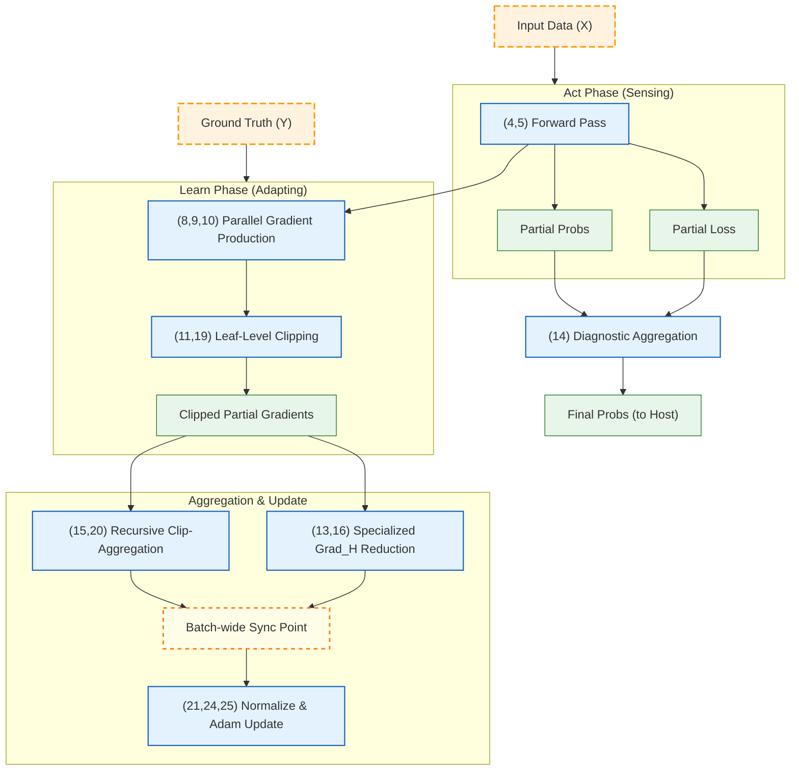

# Averaging Ensembled Classifier: A Computational Organism


This is not a static model; it is a computational organism. Born from the `Entelechy` framework's philosophy, it is an architecture that lives, breathes, and adapts. It does not merely execute commands; it senses its environment—the scale of the problem and the pressure on its memory—and makes a metabolic choice between raw speed and guaranteed survival. It is an engine forged to solve classification problems with principled elegance and profound resilience.

### The Three Pillars of Existence

The engine's vitality rests upon three foundational design principles, each a load-bearing pillar of the architecture.

#### I. Survival: The Primacy of Memory
The organism is not bound to a single execution model that fails when a problem exceeds the bounds of VRAM. Instead, it possesses a **metabolic switch**. Faced with a "data tsunami," it makes a strategic choice:
-   **Cache Mode:** When memory is plentiful, it operates at maximum velocity, caching intermediate results for the fastest possible learning.
-   **Recompute Mode:** When starved for memory, it gracefully transitions to a survival strategy, discarding and recomputing intermediate data on the fly. This guarantees its ability to process problems of literally any scale without failure, trading time for space in an elegant act of self-preservation.

#### II. Scale: The Indirection Contract
To command an ensemble of potentially thousands of classifier modules, the architecture rejects naive, memory-bound summation (`O(N)`). Instead, it commands a **Recursive Aggregation Engine**, a sophisticated, multi-stage reduction tree (`log_K(N)`) whose power is unlocked by its central nervous system: the **Indirection Contract**. By providing its kernels with a simple `offset_list` to gather scattered partial results, the engine avoids costly intermediate memory copies, maximizing available bandwidth for pure computation.

#### III. Stability: The Regulatory Funnel
The organism abandons simplistic, one-size-fits-all gradient clipping. It employs a sophisticated, **Policy-Driven Stabilization Strategy** that acts as an intelligent regulatory funnel:
-   It is more permissive at the leaves of its reduction tree, preserving the vital information in initial partial gradients.
-   It becomes progressively stricter as gradients are aggregated, ensuring the final, powerful sum remains stable and controllable.
-   It formally severs the concerns of **Algorithmic Regulation** (the user's desired `max_grad_norm`) from **Numerical Safety** (the hardware's physical limits), making it numerically robust by immutable design.

### The Heartbeat: A Stimulus-Response Cycle
The system's operation is formally separated into two phases, allowing it to natively support two fundamental modes of interaction with the world.

1.  **The "Act" Phase (Sensing):** Triggered by input data (`X`), the system performs a complete forward pass. This is a self-contained act of perception that produces a final, usable prediction and all intermediate state required for potential learning.
2.  **The "Learn" Phase (Adapting):** Triggered by the arrival of ground truth (`Y`), the system initiates backpropagation. It uses the state generated during a prior "Act" phase to update its internal parameters.

This decoupling is a core feature. It allows for both **sequential learning** (where the same `X` is used for `Act` and `Learn`) and **asynchronous learning** (where predictions are made on a live `X`, while learning occurs later on a different, historical `(X, Y)` pair).

The dataflow below illustrates the internal dependencies, where the Learn phase is contingent upon the state created by the Act phase.



### A Crucible of Constraint: The Power of OpenCL 1.2
This architecture was forged in a crucible of deliberate constraint: to target **OpenCL 1.2 *without* relying on Atomics**. This restriction rendered the simple path of `atomic_add` impassable. It *forced* the design to confront the problem of parallelism head-on, giving rise to the more sophisticated, elegant, and ultimately more robust parallel reduction patterns that form the very heart of the engine. This choice ensures maximum hardware compatibility, allowing the organism to thrive in the widest possible range of computational environments.

### Multi-Backend Execution
The engine executes through a **plan-as-data-structure** model: a shared orchestration layer constructs an immutable, backend-neutral execution plan, which each backend renders using its native execution model.

| Backend | Status | Execution Primitives |
| :--- | :--- | :--- |
| **OpenCL** | Reference implementation | `clEnqueueNDRange` + `cl.Event` synchronization |
| **CPU** | ✅ **Implemented** (FP8 support) | SIMD-vectorized C kernels (`libcpu_kernels.so`) + persistent thread pool via `pool_dispatch_and_wait` |
| **Vulkan** | ✅ **Implemented** (FP8 support) | SPIR-V compute shaders via `vkCmdDispatch` + pipeline barriers |

All three backends support the three-role precision model (storage/compute/state). The CPU and Vulkan backends additionally support FP8 (E4M3/E5M2) storage precision with FP16/FP32/FP64 compute, achieving 4× bandwidth compression vs. FP32.

The CPU backend requires zero additional Python dependencies beyond `ctypes` (stdlib). It supports AVX-512, AVX2, SSE2, ARM NEON, and a scalar fallback, auto-detecting the optimal ISA at compile time. See [`CPU_BACKEND.md`](./CPU_BACKEND.md) for the full architecture.

### Precision Configuration

#### FP8 Storage (Maximum Bandwidth)

For bandwidth-limited workloads, FP8 storage achieves 4× compression vs. FP32:

```python
from shared.precision_config import PrecisionConfig

# E4M3: 3 mantissa bits, max value 448
cfg = PrecisionConfig.fp8_e4m3()

# E5M2: 2 mantissa bits, max value 57344 (wider range)
cfg = PrecisionConfig.fp8_e5m2()

# E4M3 with FP64 compute + FP64 optimizer state for extended stability
cfg = PrecisionConfig.fp8_e4m3_f64()
```

FP8 is **storage-role only** — compute uses FP16, FP32, or FP64; state uses FP32 or FP64.
Attempting FP8 compute or state raises `ValueError`.

#### Compute precision options

| Factory | Storage | Compute | State | Use Case |
|:---|:---|:---|:---|:---|
| `fp8_e4m3()` | E4M3 | FP32 | FP32 | Standard bandwidth-optimized training |
| `fp8_e4m3_f16()` | E4M3 | FP16 | FP32 | Maximum throughput on FP16-accelerated hardware |
| `fp8_e4m3_f64()` | E4M3 | FP64 | FP64 | Extended stability for long training runs |
| `fp8_e5m2()` | E5M2 | FP32 | FP32 | Wider range (57344 max) for gradient outliers |
| `fp8_e5m2_f16()` | E5M2 | FP16 | FP32 | Wider range + FP16 compute throughput |
| `fp8_e5m2_f64()` | E5M2 | FP64 | FP64 | Wider range + extended stability |

Non-default combinations (e.g., FP16 compute + FP64 state) are created via constructor.

#### When to use FP8

- Memory bandwidth is the bottleneck
- Activations and gradients are well-conditioned (no extreme outliers)
- 448 (E4M3) or 57344 (E5M2) max value is sufficient

#### When NOT to use FP8

- Training large models where state precision matters (use `fp8_e4m3_f64()`)
- Debugging numerical issues (use FP32 for reproducibility)
- Workloads with extreme dynamic range (E5M2 may help, or use FP16)

---

### The Canonical Archives
This document provides the spirit of the architecture. To understand its flesh and bone, its laws and its logic, you must consult the canonical sources:

*   **The Philosophical Blueprint:** For the unabridged design philosophy, data contracts, validation scenarios, and the full computational graph, see [1: `CONCEPT.md`](./CONCEPT.md).
*   **The Implementation Blueprint:** For concrete data structures, module layout, build system, multi-backend design, test strategy, and the phase-gated migration plan, see [2: `DESIGN.md`](./DESIGN.md).
*   **The Book of Law:** For the inviolable Host-Device interface, parameter naming conventions, and memory layout contracts, see [3: `CONTRACT.md`](./CONTRACT.md).
*   **The Kernel Declarations:** For the ground-truth C-level function signatures that are the final authority for all kernel launches, see [`kernels/kernels.cl.h`](./kernels/kernels.cl.h).
*   **The CPU Architecture:** For the SIMD + multi-core execution model, threading design, reduction engine, and per-kernel analysis, see [`CPU_BACKEND.md`](./CPU_BACKEND.md).
*   **The Vulkan Architecture:** For the explicit GPU compute model with pre-compiled SPIR-V pipelines, see [`VULKAN_BACKEND.md`](./VULKAN_BACKEND.md).
